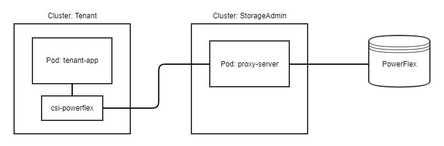

<!--
Copyright (c) 2021 Dell Inc., or its subsidiaries. All Rights Reserved.

Licensed under the Apache License, Version 2.0 (the "License");
you may not use this file except in compliance with the License.
You may obtain a copy of the License at

    http://www.apache.org/licenses/LICENSE-2.0
-->

# Karavi Authorization

Karavi Authorization is part of the [Karavi](https://github.com/dell/karavi) open source suite of Kubernetes storage enablers for Dell EMC products. Karavi Authorization provides storage and Kubernetes administrators the ability to apply RBAC for Dell EMC CSI Drivers by deploying a proxy between the CSI driver and the storage system to enforce role based access and usage rules.

Storage administrators of compatible storage platforms will be able to apply quota and RBAC rules that instantly and automatically restrict cluster tenants usage of storage resources. Users of storage through Karavi Authorization do not need to have storage admin root credentials to access the storage system.

Kubernetes administrators will have an interface to create, delete, and manage roles/groups that storage rules may be applied. Administrators and/or users may then generate authentication tokens that may be used by tenants to use storage with proper access policies being automatically enforced.

The following diagram shows a high-level overview of Karavi Authorization with a `tenant-app` that is using a Dell CSI driver  to perform storage operations through the Karavi Authorization `proxy-server` to access the Powerflex` storage system. All requests from the CSI driver will contain the token for the given tenant that was granted by the Storage Administrator.

**Note: Information in this guide is subject to change prior to the first major release.**

## Table of Contents
- [Code of Conduct](./docs/CODE_OF_CONDUCT.md)
- [Getting Started Guide](./docs/GETTING_STARTED_GUIDE.md)
- [Branching Strategy](./docs/BRANCHING.md)
- [Contributing Guide](./docs/CONTRIBUTING.md)
- [Maintainers](./docs/MAINTAINERS.md)
- [Support](#support)
- [About](#about)

## Support

Don’t hesitate to ask! Contact the team and community on [our support page](https://github.com/dell/karavi-authorization/blob/main/docs/SUPPORT.md).
Open an issue if you found a bug on [Github Issues](https://github.com/dell/karavi-authorization/issues).

## About

Karavi Authorization is 100% open source and community-driven. All components are available under [Apache 2 License](https://www.apache.org/licenses/LICENSE-2.0.html) on GitHub.
